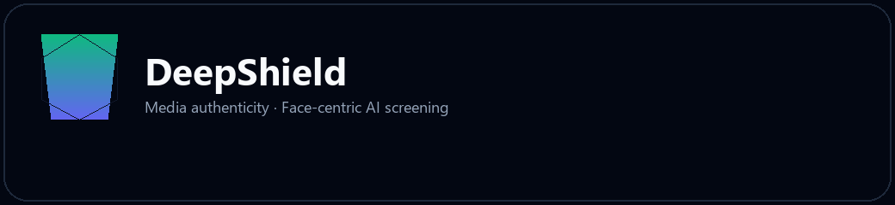
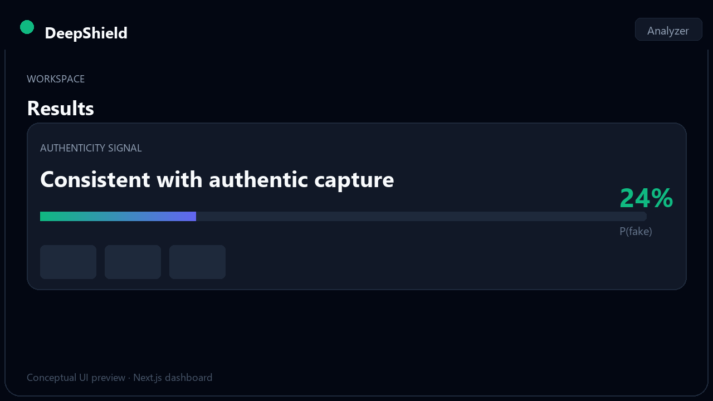
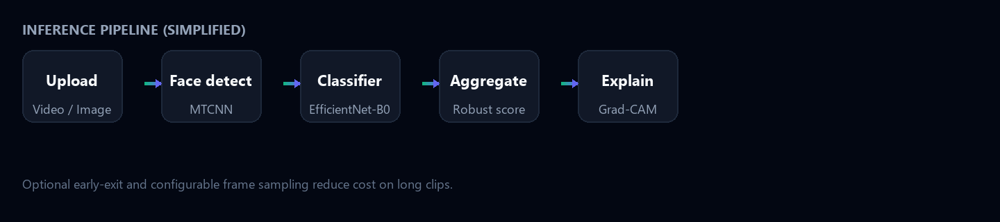
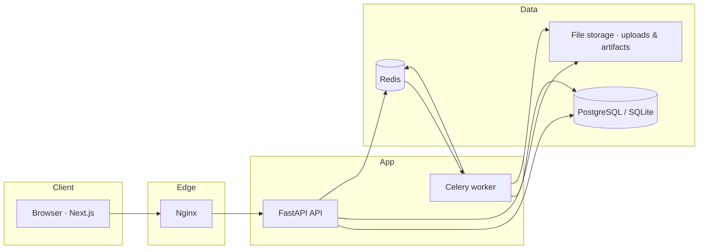

# DeepShield AI

<p align="center">
  
</p>
<p align="center">
  <sub><strong>Brand</strong> — <code>docs/images/deepshield-mark.png</code></sub>
</p>

<p align="center">
  <em>Face-centric deepfake screening with explainable AI for research, education, and product pilots.</em>
</p>

<p align="center">
  <code>EfficientNet-B0</code> · <code>MTCNN</code> · <code>Grad-CAM</code> · <code>FastAPI</code> · <code>Next.js</code> · <code>Docker</code>
</p>

---

## Table of contents

- [Overview](#overview)
- [Problem statement](#problem-statement)
- [What DeepShield does](#what-deepshield-does)
- [Screenshots and diagrams](#screenshots-and-diagrams)
- [Architecture](#architecture)
- [Key features](#key-features)
- [Repository layout](#repository-layout)
- [Quick start](#quick-start)
- [API summary](#api-summary)
- [Freemium SaaS mode](#freemium-saas-mode)
- [Machine learning & training](#machine-learning--training)
- [Configuration](#configuration)
- [Database migrations](#database-migrations)
- [Operations & observability](#operations--observability)
- [Environment files](#environment-files)
- [ML expectations & evaluation](#ml-expectations--evaluation)
- [Development & Git workflow](#development--git-workflow)
- [Testing](#testing)
- [Limitations & responsible use](#limitations--responsible-use)
- [Documentation index](#documentation-index)

---

## Overview

DeepShield is an end-to-end stack for **screening faces in images and video** using a learned authenticity signal, **robust score aggregation**, and **optional attention overlays** on the most uncertain frames. It ships with a **REST API**, a **Next.js** web experience (marketing content plus an analyzer workspace), **background workers** for heavy jobs, and an **optional SaaS layer** (JWT sessions with **HttpOnly cookies** and/or **Bearer** tokens, free-tier limits). The backend supports **Alembic** migrations, **Prometheus-style metrics** at `/api/metrics`, and **liveness/readiness** probes for orchestration.

---

## Problem statement

Synthetic and manipulated media are now easy to produce at scale. **Face swaps**, **expression transfers**, and **reenactment** can make it difficult for viewers, investigators, and platform operators to know whether a face in a video or image **reflects a real capture** or has been **algorithmically altered**.

Typical challenges include:

| Challenge | Why it matters |
|-----------|----------------|
| **Black-box scores** | A single probability with no context does not support review workflows or audits. |
| **Domain shift** | Models trained on one corpus may behave unpredictably on new cameras, codecs, or compression. |
| **Scope of signal** | Many detectors are **face-focused** by design; they are not general “pixel tampering” or audio detectors. |
| **Trust & misuse** | Automated scores can be misunderstood as legal proof; clear limitations and UI framing matter. |

**DeepShield** targets the subset of the problem where the question is: *given detected faces in uploaded media, does the model assign a manipulation-like signal consistent with synthetic or altered face content, and where should a human look first?* It is aimed at **research**, **education**, and **product pilots**—not at replacing certified forensic labs or legal findings.

---

## What DeepShield does

DeepShield provides:

1. **Upload** of video (MP4/MOV) or images (JPEG/PNG) through a REST API and a **long-form Next.js dashboard** (marketing sections + analyzer).
2. **Face detection & cropping** (e.g. MTCNN), with a pipeline oriented toward **largest face per frame** for video.
3. **Per-face classification** using an **EfficientNet-B0**-style head with configurable checkpoint path.
4. **Aggregation** of frame-level scores into a **single interpretable summary** (with low-confidence paths when evidence is weak).
5. **Optional Grad-CAM**-style overlays on **top-K suspicious frames** to support human review (attention maps, not ground-truth causality).
6. **Background processing** via **Celery + Redis** in Docker, with job persistence in **PostgreSQL** (or **SQLite** locally).
7. **Optional SaaS mode**: **JWT auth** (HttpOnly session cookie on login/register plus optional JSON `access_token`), per-user jobs, and **free-tier daily upload limits** ([docs/SAAS.md](docs/SAAS.md)).

---

## Screenshots and diagrams

Project artwork and documentation images live in [`docs/images/`](docs/images/). The **brand banner** at the top of this file is **`deepshield-mark.png`**. The table below shows a **conceptual UI preview** (analyzer and results layout) and a **simplified inference pipeline** diagram.

<table>
  <tr>
    <td width="50%" valign="top" align="center">
      
      <p align="center"><strong>Figure 1 — Dashboard concept</strong><br /><sub>Results workspace · authenticity signal and frame review (illustrative)</sub></p>
    </td>
    <td width="50%" valign="top" align="center">
      
      <p align="center"><strong>Figure 2 — Inference pipeline (simplified)</strong><br /><sub>Upload → face detect → classify → aggregate → explain</sub></p>
    </td>
  </tr>
</table>

<p align="center">
  <sub><strong>Regenerating assets:</strong> run <code>python scripts/generate_docs_images.py</code> from the repo root (requires Pillow). For production READMEs, you may replace these with PNG screenshots exported from the running application (e.g. <code>docs/images/screenshot-analyzer.png</code>).</sub>
</p>

---

## Architecture

High-level request flow (Docker / production-style):



End-to-end sequence (video job) is documented in [docs/architecture.md](docs/architecture.md). The staged flow corresponds to **Figure 2** (inference pipeline) in [Screenshots and diagrams](#screenshots-and-diagrams).

---

## Key features

| Area | Description |
|------|-------------|
| **Explainability** | Top-K frames with optional heatmap URLs; authenticity bar and labels in the UI (Recharts). |
| **Async jobs** | Queue-based processing with `/api/results/{job_id}` polling; optional Socket.IO updates. |
| **Configurable limits** | Upload size, duration, frame caps, aggregation, cleanup TTL—via environment ([backend/app/config.py](backend/app/config.py)). |
| **SaaS-ready** | Register/login, JWT (Bearer or HttpOnly cookie), job ownership, artifact access control, free-tier quotas. |
| **Operations** | `/api/health`, `/api/health/live`, `/api/health/ready`, Prometheus metrics at `/api/metrics`, OpenAPI docs, Docker Compose. |
| **Database** | **Alembic** migrations under `backend/migrations/`; dev/test may use `init_db()` instead of upgrading. |

---

## Repository layout

| Path | Role |
|------|------|
| `backend/` | FastAPI app, Celery, SQLAlchemy models, **Alembic** migrations (`backend/migrations/`), inference pipeline hooks |
| `frontend/` | Next.js 14 app router, dashboard & landing sections |
| `nginx/` | Reverse proxy: UI, `/api/*`, Socket.IO |
| `ml/` | Training scripts and ML-related utilities |
| `docs/` | Architecture, API, SaaS, training, evaluation |

---

## Quick start

### Docker Compose (recommended)

From the repository root:

```powershell
cd "deepfake detection"
docker compose up --build
```

| Endpoint | Purpose |
|----------|---------|
| **Web UI** | [http://localhost:8001](http://localhost:8001) (see `docker-compose.yml` for the host port) |
| **OpenAPI / Swagger** | [http://localhost:8001/api/docs](http://localhost:8001/api/docs) |

Compose typically sets `DATABASE_URL` for PostgreSQL, Redis for Celery, and optional SaaS variables—see [docker-compose.yml](docker-compose.yml).

### Local API (without Docker)

- Install Python deps: `pip install -r backend/requirements.txt`
- Run Uvicorn against the FastAPI app (see project scripts or `backend/app/main.py`).
- Without `DATABASE_URL`, the app uses SQLite under `STORAGE_DATA_DIR` (default `./data`).

### Local frontend with remote API

If Next.js runs on port **3000** and the API on **8000**, set:

```text
BACKEND_PROXY_URL=http://127.0.0.1:8000
```

Then:

```powershell
cd frontend
npm install
npm run dev
```

---

## API summary

All REST routes are under the **`/api`** prefix. Interactive documentation: **`/api/docs`**.

### Core analysis

| Method | Path | Purpose |
|--------|------|---------|
| `GET` | `/api/health` | Basic health (model id, status) |
| `GET` | `/api/health/live` | Liveness (process up) |
| `GET` | `/api/health/ready` | Readiness (DB ping; optional Redis if `REQUIRE_REDIS_FOR_READY=true`) |
| `GET` | `/api/metrics` | Prometheus text format (enable/disable via `ENABLE_PROMETHEUS_METRICS`) |
| `POST` | `/api/analyze-video` | Multipart upload (`file`) — video |
| `POST` | `/api/analyze-image` | Multipart upload (`file`) — image |
| `GET` | `/api/results/{job_id}` | Job state, progress, result JSON |
| `GET` | `/api/artifacts/{job_id}/{name}` | Artifacts (e.g. heatmap PNG). With SaaS auth, owner-only via **Bearer** or **session cookie** |

### Authentication & jobs (SaaS)

| Method | Path | Auth |
|--------|------|------|
| `POST` | `/api/auth/register` | No — sets HttpOnly JWT cookie; optional `access_token` in JSON (`SAAS_RETURN_TOKEN_IN_BODY`) |
| `POST` | `/api/auth/login` | No — same as register |
| `POST` | `/api/auth/logout` | Clears session cookie |
| `GET` | `/api/auth/me` | Bearer **or** HttpOnly cookie |
| `GET` | `/api/jobs/me` | Bearer **or** cookie |

When `SAAS_REQUIRE_AUTH=true`, protected routes require a valid JWT via **`Authorization: Bearer <token>`** or the **`Set-Cookie` session** from login. The Next.js app uses **`credentials: "include"`** on API calls so cookies work behind the dev proxy. Details: [docs/SAAS.md](docs/SAAS.md).

Further HTTP notes: [docs/api.md](docs/api.md).

---

## Freemium SaaS mode

Optional **accounts**, **JWT** sessions (cookie + optional body token), **per-user jobs**, and **free-tier daily upload limits**.

- Backend: `SAAS_REQUIRE_AUTH`, `SAAS_JWT_SECRET`, `SAAS_JWT_EXP_HOURS`, `SAAS_FREE_DAILY_UPLOADS`, plus cookie flags `SAAS_AUTH_COOKIE_NAME`, `SAAS_AUTH_COOKIE_SECURE`, `SAAS_AUTH_COOKIE_SAMESITE`, `SAAS_RETURN_TOKEN_IN_BODY` (see [`.env.example`](.env.example) and [backend/app/config.py](backend/app/config.py)).
- Frontend: `NEXT_PUBLIC_SAAS_REQUIRE_AUTH=true` to force sign-in in the UI. The analyzer calls `/api/auth/me` with cookies for the gate.
- **Production:** strong unique `SAAS_JWT_SECRET`, HTTPS, and typically `SAAS_AUTH_COOKIE_SECURE=true`. For cross-site HTTPS UIs, configure `SameSite=None` only with `Secure`.

Full reference: [docs/SAAS.md](docs/SAAS.md).

---

## Machine learning & training

- **Weights:** set `INFER_MODEL_WEIGHTS_PATH` to your checkpoint (default resolves under `data/models/`).
- **Fine-tuning:** dataset layout and training entry points are described in [docs/TRAINING.md](docs/TRAINING.md) and [ml/train/README.md](ml/train/README.md).
- **Offline evaluation:** metrics and splits in [docs/ML_EVALUATION.md](docs/ML_EVALUATION.md).

Example training invocation:

```powershell
python ml/train/train_efficientnet.py --data-root .\data\my_dataset --epochs 10 --out .\data\models\efficientnet_b0.pth
```

---

## Configuration

### Environment files

| File | Purpose |
|------|---------|
| **[`.env.example`](.env.example)** | Root template: database, Redis/Celery, SaaS, ML path, logging, **future** Stripe/OAuth/SMTP placeholders. |
| **`frontend/.env.example`** | Next.js: `BACKEND_PROXY_URL`, `NEXT_PUBLIC_*`. Copy to **`frontend/.env.local`**. |
| **`docker-compose.override.yml.example`** | Optional Compose overrides (copy to `docker-compose.override.yml`, gitignored). |

**Local backend:** copy `.env.example` → `.env` at the repo root. The API loads it automatically via `python-dotenv` when `backend/app/config.py` is imported (after `pip install -r backend/requirements.txt`). Do **not** commit `.env`.

**Docker Compose:** variables are still set in [`docker-compose.yml`](docker-compose.yml); you can add a root `.env` and reference it with Compose `env_file` later if you prefer one file for secrets.

Centralized environment-driven settings live in **`backend/app/config.py`**, including:

- File upload limits and allowed MIME types  
- Video sampling, max frames, early-exit heuristics  
- Face detection thresholds  
- Inference batch size, model path, Grad-CAM budget  
- Storage paths, artifact URL prefix, cleanup TTL  
- SaaS / JWT / free tier / cookie policy  

Optional rate limiting: `RATE_LIMIT_RPS` (0 disables).  
CORS: `CORS_ALLOWED_ORIGINS` (comma-separated; required for browser clients when not using the Next.js dev proxy). The API enables **`allow_credentials`** so browsers can send **HttpOnly** session cookies to trusted origins (see `backend/app/main.py`).

**Decision policy:** `INFER_FAKE_DECISION_THRESHOLD` (0–1, default `0.5`) — if `final_score` (aggregated p_fake) is at or above this value and the run is not marked low-confidence, the API sets `predicted_manipulation: true` in the result JSON. Tune this on **your** validation set; it is a product/policy choice, not a universal constant.

### Database migrations

With **PostgreSQL** (or any persistent database), apply schema with **Alembic** from `backend/`:

```powershell
cd backend
pip install -r requirements.txt
$env:PYTHONPATH="."
alembic upgrade head
```

Set **`RUN_DB_MIGRATIONS_ON_STARTUP=true`** to run `alembic upgrade head` when the API starts (typical for production containers). Local tests and SQLite-focused workflows keep **`RUN_DB_MIGRATIONS_ON_STARTUP`** unset so **`init_db()`** runs instead.

### Operations & observability

| Concern | Env / route | Notes |
|---------|-------------|--------|
| Metrics | `GET /api/metrics` | Toggle with **`ENABLE_PROMETHEUS_METRICS`** (default on). |
| Readiness | `GET /api/health/ready` | DB always; set **`REQUIRE_REDIS_FOR_READY=true`** to require Redis (broker) up. |
| Liveness | `GET /api/health/live` | Lightweight process check. |

---

## ML expectations & evaluation

DeepShield is a **face-centric screening** tool, not a certificate of real-world truth or legal authenticity.

- **No open-world guarantee:** Accuracy depends on training data, compression, and domain. Calibrate `INFER_FAKE_DECISION_THRESHOLD` using held-out data and your target trade-off (false positives vs false negatives). See [docs/ML_EVALUATION.md](docs/ML_EVALUATION.md) and [ml/train/README.md](ml/train/README.md).
- **Outputs are probabilistic:** `final_score` and `predicted_manipulation` support triage and review workflows; they are not a substitute for forensic lab analysis.
- **Explainability:** Grad-CAM-style overlays indicate where the model focused; they do not prove an edit location.
- **Improvement path:** invest in **data coverage**, **rigorous evaluation** (AUC, EER, TPR@FPR), and **reproducible** training runs before promising “production-grade” detection.

Result payloads include `decision_threshold` and `predicted_manipulation` (or `null` when low-confidence / insufficient evidence) so clients stay aligned with server policy.

---

## Development & Git workflow

- **Branching:** use short-lived feature branches; open PRs for review when collaborating.
- **Commits:** prefer [Conventional Commits](https://www.conventionalcommits.org/) style, e.g. `feat(api): add decision fields`, `fix(frontend): align score panel with threshold`, `test(backend): add policy unit tests`, `docs: update evaluation section`.
- **Do not commit:** `.env`, `node_modules/`, `.next/`, secrets, or local SQLite under `backend/data/` (see [.gitignore](.gitignore)).
- **Pre-push checks (recommended):** from `backend/`, `pytest -q`; from `frontend/`, `npm run lint` and `npm run build`.

---

## Testing

```powershell
cd backend
pip install -r requirements.txt
pytest -q
```

Backend tests live in `backend/tests/`: API smoke tests, auth (Bearer and cookie session for `/auth/me`), health/live/ready/metrics, upload validation, and **policy** unit tests for `predicted_manipulation` (`test_result_decision.py`). They avoid heavy ML and Celery by design.

**Frontend (optional):**

```powershell
cd frontend
npm install
npm run lint
npm run build
```

---

## Limitations & responsible use

- Tuned for **face manipulation** signals; it does **not** assert **legal authenticity** or chain-of-custody.
- **Grad-CAM** visualizations show **where the model looked**, not definitive proof of editing.
- Performance depends on **training data**, **compression**, and **domain**; calibrate before high-stakes use.
- Suitable for **research**, **education**, and **product experimentation**; not a substitute for certified forensic analysis.

---

## Documentation index

| Document | Content |
|----------|---------|
| [docs/architecture.md](docs/architecture.md) | Components, sequence diagram, DB notes |
| [docs/api.md](docs/api.md) | HTTP API overview |
| [docs/SAAS.md](docs/SAAS.md) | Auth, env vars, frontend flags |
| [docs/TRAINING.md](docs/TRAINING.md) | Fine-tuning EfficientNet-B0 |
| [docs/ML_EVALUATION.md](docs/ML_EVALUATION.md) | AUC, EER, evaluation guidance |
| [docs/setup.md](docs/setup.md) | Additional setup notes |

---

<p align="center">
  <sub><strong>DeepShield</strong> — Research and educational use. Outputs are not legal evidence or a substitute for certified forensic analysis.</sub>
</p>
