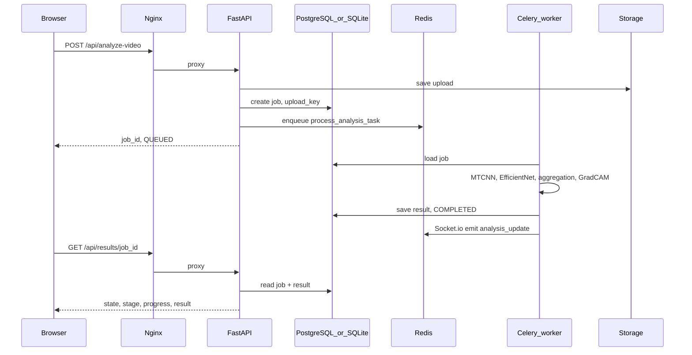

# Architecture

## Request flow (video)

## Components

- **API** (`backend/app/main.py`): FastAPI + Socket.io (Redis manager) for optional live updates from workers.
- **Worker** (`docker-compose` service `worker`): Celery executes `process_analysis_task` in `backend/app/api/routes/analyze.py`.
- **Persistence**: Jobs and results via SQLAlchemy (`backend/app/db/`). Engine URL from `DATABASE_URL` or SQLite file.
- **Artifacts**: Files under configurable storage dir; served via `/api/artifacts/...`.

## Why two databases?

- **SQLite**: zero-setup local development.
- **PostgreSQL**: shared state between API and multiple workers in Docker.

## Related docs

- [API.md](API.md) — endpoint summary
- [ML_EVALUATION.md](ML_EVALUATION.md) — offline evaluation
